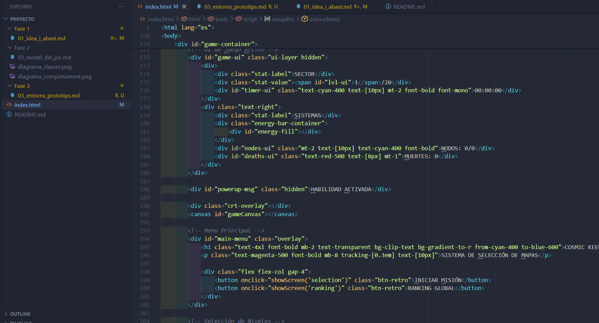
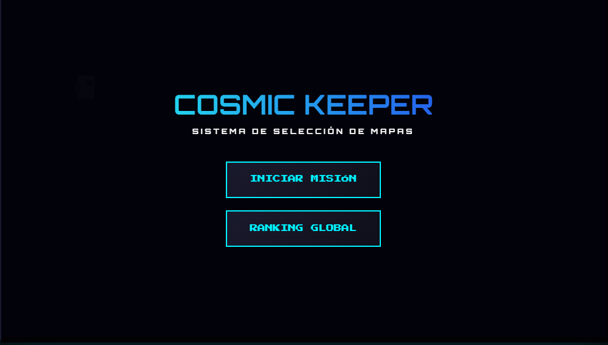
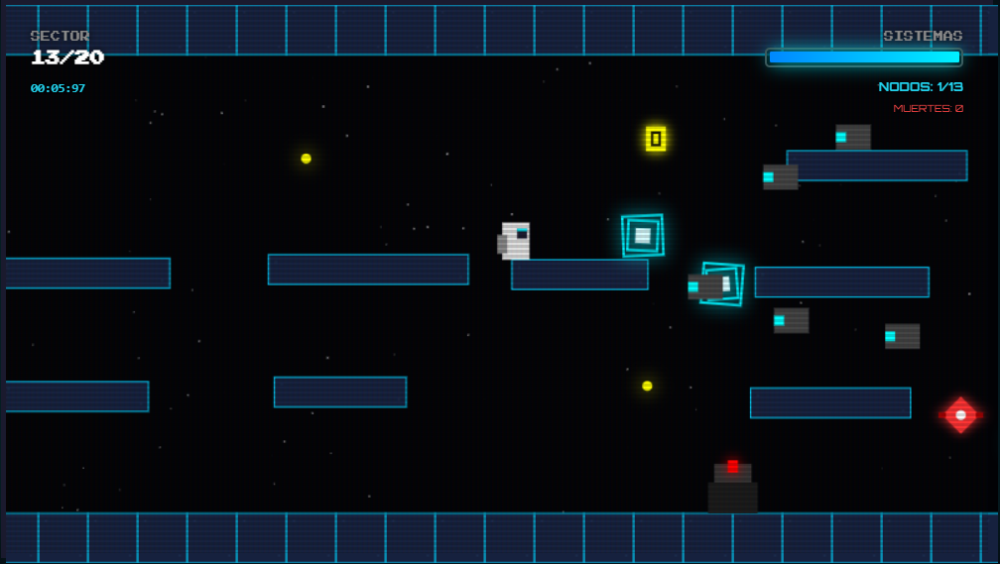

# COSMIC KEEPER  
## Disseny de Sistema i Abast del Projecte

**Autor:** Izan de Maya

---

## 1. IDE utilitzat i configuració bàsica

Per desenvolupar aquest prototip, he optat per una configuració senzilla que em permeti programar i provar canvis ràpidament.

* **Editor de codi:** He fet servir **Visual Studio Code (VS Code)**. M'agrada perquè és lleuger i té extensions que m'ajuden a mantenir el codi net.
* **Eines de suport:**
    * **Live Server:** Una extensió de VS Code que em permet obrir el joc al navegador i veure com s'actualitza sol cada vegada que guardo un canvi.
    * **Tailwind CSS:** L'he fet servir mitjançant el seu enllaç CDN a la capçalera de l'HTML per poder dissenyar la interfície (menús, botons, barres d'energia) ràpidament sense haver de crear molts fitxers CSS externs.
    * **Consola de desenvolupador (Chrome):** Molt útil per fer el *debug* de les col·lisions i per comprovar que la generació de mapes no donés errors de memòria.

---

## 2. Decisions inicials d’implementació

La idea era crear un joc de plataformes d'estil "retro" però amb mecàniques modernes.

* **Motor de joc (Canvas API):** En lloc de fer servir un motor extern, he decidit programar el motor des de zero amb JavaScript i l'element `<canvas>`. He creat un **Game Loop** que s'encarrega d'actualitzar la física i dibuixar els frames a 60 FPS.
* **Física del jugador:** He implementat un sistema de moviment basat en acceleració i fricció. El personatge té un "jetpack" que consumeix energia, així que he hagut d'ajustar la gravetat i la potència del salt per fer-lo divertit però exigent.
* **Generació procedural:** Perquè cada partida fos diferent, he programat una funció que genera les plataformes, els enemics i els nodes de forma automàtica. Cada nivell canvia de color i dificultat segons el "bioma".
* **Interfície i dades:** He separat la interfície del joc (menús) de la part del Canvas. He fet servir el `localStorage` per guardar els rècords del jugador, de manera que el progrés no es perdi en tancar la pestanya.

---

## 3. Evidències visuals

### Captura de l’IDE en funcionament
Aquí es veu el meu entorn de treball amb el codi del joc obert i com estic gestionant les funcions de moviment i dibuix.

### Prototip executable
El joc arrenca sense errors i mostra el menú principal des d'on es pot accedir a la selecció de nivells.

---

## 4. Control de Versions (Git)

He seguit un control de versions bàsic per organitzar el desenvolupament. He fet com a mínim 3 commits descriptius:

1. `feat: initial structure and game loop`: Muntatge de l'HTML base i el bucle de renderitzat.
2. `feat: player physics and collision logic`: Implementació del moviment, salts i col·lisió amb les parets.
3. `feat: procedural levels and UI menu`: Afegit el sistema de generació de mapes i els menús interactius.

---

## 5. Estat del Prototip

* **Interacció:** El personatge es controla amb el teclat (WASD / Espai) i també té botons en pantalla per si es prova des d'un mòbil.
* **Execució:** El joc arrenca perfectament, permet recollir nodes, esquivar enemics que disparen i passar de nivell a través del portal.
* **Bucle funcional:** La lògica d'actualització és constant i gestiona correctament la mort del jugador i el canvi de dificultat.

**Repositori:** [Posa aquí l'enllaç al teu GitHub]